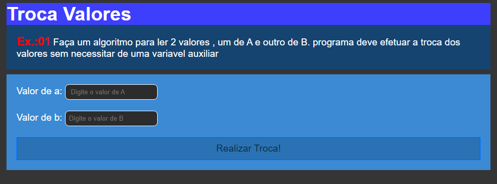

# Troca Caracteres

Este `projeto` foi criado para fins de exercícios em `Javascript`. Basicamente o projeto começa recebendo dois `valores` o valor de `a` e o valor de `b` de lembrar que nenhum dos `campos` tem que estar `vazio` se for o caso vai retornar um `erro`. O `usuário` tem que digitar devidamente os valores em cada `campo`, em seguida para o projeto `funcionar` tem que ser `clicado` o `botão` abaixo `Realizar Troca` automaticamente o valor que estiver no campo `a` vai `passar` para o campo `b` e o `b` vai passar para o `a` na medida que botão vai sendo clicado..☺😎

## Tecnologias

As seguintes ferramentas foram usadas na constuição deste projeto:

- HTML
- CSS
- JAVASCRIPT

#

Feito por ❤ Pascoal Kahamba meu [Linkedin](https://www.linkedin.com/in/pascoal-kahamba-7b43bb233?lipi=urn%3Ali%3Apage%3Ad_flagship3_profile_view_base_contact_details%3BTg8LEKayToyytOX1pVAQ%2Bg%3D%3D)

[👉Clique aqui se quiseres rodar o projeto👈](https://meu-portfolio-delta.vercel.app/)😎
